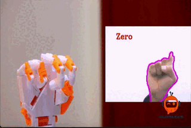
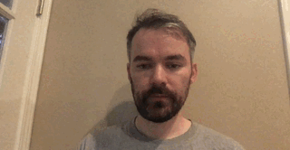
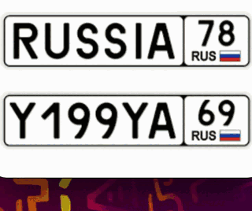
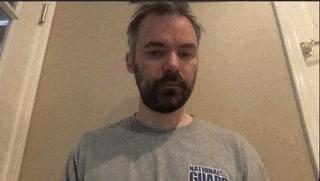

# traditional-cv
Following along with the LEARN OPENCV tutorial on youtube

## Scripts

**basic_functions**

Shows basic functionality of opencv in different

**color_detection**

Finds object by color in an image, displays it and a mask of the detection

**color_picker**

A convenience script to find which hsv values are suitable to detect an object in the webcam 

**document_scanner**

Finds a document an an image, warps it for presentation and displays

**face_detection**

Using a cascade classifier finds a face an an image

**import_image**

Imports an image from Resources and displays it

**import_video**

Imports a video from Resources and displays it

**import_webcam**

Shows a webcam if you have one

**license_plate_detector**

Uses a cascade classifier to find russian license plates in images

**rescaling**

Resizing and cropping functionality in opencv

**shape_detection**

Detecting shapes and classifying them using the number of corners in their contours

**shapes**

Draws shapes on an image

**virtual_painter**

Opens a webcam where If I hold a red or blue marker/pencil correctly it draws on the image

**warp_perspectives**

Crops a section in an image and projects it to be forward facing

## Setup

**Bare Metal (Unix)**

*Requirements*

- g++ compiler

*steps*

- Build with: `./build.sh`
- `cd src`
- Run scripts like this: `SCRIPT=import_image ./main`

**VS Code**

This code can be ran with vscode without docker.

*Requirements*

- visual studio code
- g++ compiler

*steps*

- open entrypoint at src/main.cpp
- hit play button to build the solution
- choose a scipt to run in `.vscode/tasks.json`
- go to debug tab on left and hit play

